# 架构说明

## 边界与原则

本项目把“可公开验证的模型事实”和“某租户如何调用模型”严格分开。目录只生成静态 JSON，不包含数据库、查询服务或常驻进程。上游格式先进入候选区；只有显式、可重复的人工提升才会生成目录文档，且不会把聚合源观察值误写成可运行能力。

| 数据域 | 目录位置 | 负责内容 | 明确禁止 |
| --- | --- | --- | --- |
| canonical model | `catalog/models/{manufacturer}/{model}.json` | 制造商、系列、生命周期、模型级模态与能力事实 | provider API 标识、价格、业务采样默认值、密钥和私有地址 |
| provider offering | `catalog/offerings/{provider}/{model-id}.json` | API 模型标识、协议、供应商限额、三态能力、参数支持/范围/官方默认值/协议映射 | Agent Policy、租户覆盖、业务默认值 |
| tenant deployment | 三个业务项目自身的受控配置 | 私有 Base URL、API Key、环境端点、负载均衡和部署别名覆盖 | 进入本仓库、CI 产物、日志或公开 CDN |
| upstream candidate | `upstream/models-dev-2026.json` 与 `upstream/logos/` | 2026 收录候选、上游提示和厂家图标来源 | 在同步任务中直接覆盖 canonical/offering、作为运行时事实或携带租户配置 |
| official review sidecar | `catalog/reviews/models-dev-2026.json` | 单条上游 offering 的官网核验、官方 API ID/协议（如有）和审计结论 | 自动改写 canonical/offering、自动放开运行时参数或携带租户配置 |

所有能力布尔值都是 `true | false | "unknown"`。`false` 只能表达来源明确证明“不支持”；证据不足必须用 `unknown`。

## 数据流

```mermaid
flowchart LR
  subgraph External["具备外网能力的 CI"]
    Official["官方文档与官方模型列表 API"]
    Aggregators["models.dev / LiteLLM 等聚合源"]
    Candidate["upstream/ 候选快照与冲突报告"]
    Logos["models.dev 候选与 Logo 快照"]
    Review["人工复核字段级证据"]
  end

  subgraph Repository["本仓库权威源"]
    Canonical["canonical model"]
    Provider["provider"]
    Offering["provider offering"]
    Alias["alias"]
    ReviewArtifact["official review sidecar"]
    Validate["Schema / 引用 / 证据 / 泄露校验"]
    Build["确定性静态构建"]
  end

  subgraph China["国内发布面"]
    ObjectStore["OSS / COS / TOS"]
    CDN["国内 CDN"]
    Probe["国内网络探测"]
  end

  subgraph Browse["人员浏览"]
    Site["index.html + CSS/JS"]
    Search["轻量 search-index"]
    Detail["按需 provider 分片"]
    ReviewDetail["按需核验侧车"]
    Browser["搜索 / 筛选 / 能力与证据详情"]
  end

  subgraph Runtime["业务消费端"]
    Manifest["先取 manifest.json"]
    Cache["版本缓存"]
    Shard["catalog 或 provider 分片"]
    Snapshot["内置快照"]
    Policy["System Default < Tenant Override < Agent Policy"]
    Filter["capability 动态过滤"]
    Adapter["ChatOpenAI / ChatAnthropic / Embeddings / DeepAgent"]
  end

  Official --> Candidate
  Aggregators --> Candidate
  Aggregators --> Logos
  Candidate --> Review
  Logos --> Build
  Review --> ReviewArtifact
  Review --> Canonical
  Review --> Provider
  Review --> Offering
  Review --> Alias
  Canonical --> Validate
  Provider --> Validate
  Offering --> Validate
  Alias --> Validate
  ReviewArtifact --> Validate
  Validate --> Build
  Build --> ObjectStore
  ObjectStore --> CDN
  CDN --> Probe
  CDN --> Site
  Site --> Manifest
  Manifest --> Search
  Search --> Browser
  Browser -->|"打开详情"| Detail
  Browser -->|"打开详情"| ReviewDetail
  CDN --> Detail
  CDN --> ReviewDetail
  CDN --> Manifest
  Manifest -->|"版本未变"| Cache
  Manifest -->|"版本变化且哈希通过"| Shard
  Manifest -->|"不可用"| Snapshot
  Cache --> Policy
  Shard --> Policy
  Snapshot --> Policy
  Policy --> Filter
  Filter --> Adapter
```

上游同步工作流只允许修改 `upstream/` 候选区并创建 PR。候选冲突、能力从 `true` 降为 `false`、限额下降或模型消失都会要求人工审核；它们不能直接修改 `catalog/` 或已发布版本。当前冻结快照的直连记录是一次明确人工提升：`scripts/promote-models-dev-2026.ts --write` 仅创建缺失的 canonical/provider/offering 文档，遇到已有不同模型或 offering 会失败，已有 provider 文档则保留。所有此类文档保留 `upstream_aggregator`、`confidence: low` 和运行时 `unknown`，后续只能以官方证据收紧或提升字段。

## 权威源与生成物

源数据按模型拆分，`npm run build` 生成：

- `dist/manifest.json`：小型入口，包含 Schema/目录/前序/最低消费版本、生成时间、每个逻辑文件的字节数、SHA-256、ETag、缓存策略、当前与不可变路径、gzip/brotli 描述。
- `dist/index.html` 与 `dist/assets/`：无框架、无境外运行时依赖的目录浏览界面；全部资源同样进入 manifest、哈希、压缩和版本化流程。
- `dist/catalog.json`：全量聚合目录。
- `dist/providers/{provider}.json`：按供应商分片。
- `dist/search-index.json`：不带大段证据正文的轻量检索索引；包含 `verification_status`、同源 `manufacturer_logo` 路径，以及 `models_dev_sync` 的收集/核验时间、来源修订和快照哈希，供卡片、详情页和增量更新比对使用。
- `dist/models-dev-2026.json`：models.dev 2026 收录候选快照；首页单独读取，保留未提升的免费、路由器和别名路线。
- `dist/reviews/models-dev-2026.json`：79 条已提升直连 offering 的逐条官方核验侧车；提供官网证据和审计结论，但每条都固定为 `keep_fail_closed`，不会自动成为 runtime offering 字段。
- `dist/assets/logos/{provider}.svg`：随 manifest、哈希、gzip/brotli 和不可变版本发布的厂家图标或明确标记的中性占位图。
- `dist/versioned/{catalog_version}/...`：包含该版本 manifest 的一年不可变缓存路径。
- `snapshots/catalog.json`：随消费端发布的、经过相同校验的内置快照。

`catalog/release.json` 是生成时间和版本的唯一输入。构建过程不读取当前时钟、不发网络请求，所有对象键递归排序，数组按稳定身份排序，压缩参数固定。因此相同源输入产生逐字节相同的目录、压缩文件和哈希。

浏览界面不是第二份权威数据：HTML 不内置具体模型，首页先取 manifest，再校验并读取轻量搜索索引；只有用户打开详情时才下载对应 provider 分片和逐条核验侧车。侧车只解释观测记录的官网核验结论，不参与 `src/runtime.ts` 的参数过滤或构造计划。所有动态文本通过 DOM `textContent` 创建，页面只连接同源资源，证据外链仅在用户主动点击后打开。浏览器缓存也以 manifest 中的版本和 SHA-256 为键，不能让旧分片混入新版本。

## 证据和字段标记

每个源文档都携带 `evidence[]` 和 `field_annotations`。标记可对应精确 JSON Pointer，也可用末尾 `/*` 覆盖子树；校验器选择最长匹配项。每个事实叶节点必须能解析到一个标记：

- `runtime_effective`：字段是否已经进入当前 FDE 模型构造、调用参数或 DeepAgent profile。
- `metadata_only`：字段是否只用于名称、搜索、状态或 UI 展示。
- `adapter_mapping`：运行时字段映射到的具体构造器或请求字段。
- `unsupported_reason`：既未生效又不是纯展示字段时的缺口原因。
- `source_ids`：引用同文件 `evidence[]` 中的字段级来源。

校验器拒绝缺失标记、悬空来源、过期标记、相互矛盾的标记以及没有缺口说明的待接入字段。

## 采样参数运行时契约

`temperature`、`top_p`、`top_k` 不是 canonical model 的业务默认配置，Schema 通过 `additionalProperties: false` 阻止它们进入 canonical 数据。offering 只说明支持三态、范围、官方默认值和协议字段。

实际值按以下优先级做浅层字段合并：

1. `System Default`
2. `Tenant Deployment Override`
3. `Agent Policy`

高优先级覆盖低优先级。随后 `src/runtime.ts` 按 offering 过滤：

- `supported=true`：范围和协议映射均通过后才发送。
- `supported=false`：不发送并记录 `unsupported_parameter`。
- `supported=unknown`：默认不发送并记录 `unknown_parameter_support`。
- 超出范围或缺少协议映射：不发送并记录诊断。

构造计划显式映射 `ChatOpenAI.temperature/topP/modelKwargs`、`ChatAnthropic.temperature/topP/topK`、`maxTokens`、`streaming`、`streamUsage`、reasoning 字段和 `model.profile.maxInputTokens`。Embedding 独立映射 `dimensions` 与 `batchSize`。任何准备进入租户配置的新运行时字段，必须先增加构造器映射和契约测试。

## 消费与故障回退

消费端算法是：

1. 每次刷新只下载 `manifest.json`。
2. 先检查 `minimum_consumer_schema_version`；消费端版本不足时保留旧缓存/快照并报警。
3. `catalog_version` 与本地缓存相同则不下载全量目录。
4. 版本变化时按 manifest 的 `immutable_path` 下载目标文件，并在解析前校验字节级 SHA-256；发布窗口内不会混用旧 manifest 和新当前路径。
5. 下载、版本、Schema 或哈希失败时继续使用最后成功缓存；没有缓存时使用内置快照。
6. 私有 `api_model_id` 不能按名称猜测能力，必须显式保存目标 `catalog_offering_id` 并标记 `catalog_binding_mode=explicit_override`，或由经过校验的同 provider alias 指向公开 offering。

当前 `src/consumer.ts` 是 TypeScript 参考实现；业务项目应实现相同状态机，并把最后成功版本持久化。目录故障不得阻塞已有模型配置。

`pro-lowcode-platform-front/LlmConfig` 的目标集成采用 iframe + postMessage：页面由 `VUE_APP_CDN_PATH + VUE_APP_LLM_CATALOG_PATH`（或部署时的 `window.__APP_ENV__`）定位，iframe 内完成 manifest/分片哈希校验、本地搜索和详情展示；父页面只接受通过 origin/source/session 校验的公开能力白名单投影，`baiteda-app` 不访问目录 CDN。后端只保存 tenant deployment、目录绑定和 FDE 所需的白名单能力投影；已有模型运行不依赖浏览器或 CDN 实时可用。具体删除/保留边界见[创建模型联动设计](llm-config-integration.md)。

## 安全边界

Schema 和递归安全扫描禁止 API Key、credential、tenant、私有 Base URL、环境端点、NAT、负载均衡和 deployment override 等字段。扫描同时拒绝常见密钥形态、URL 用户信息、localhost、回环和 RFC 1918 IPv4。发布凭据只从 CI Secret/进程环境读取，发布计划和日志不打印凭据。
