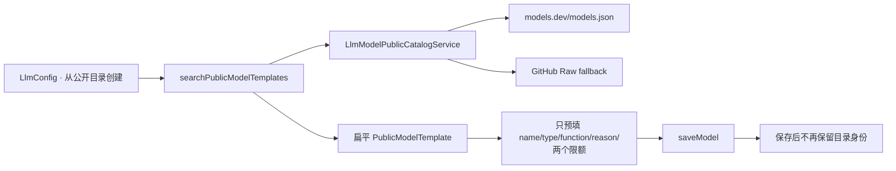
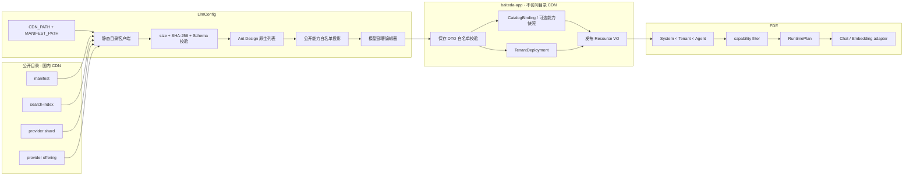

# LlmConfig 创建模型与公开目录联动设计

## 结论

`LlmConfig` 中的“从公开目录创建”不应继续被理解为“复制几个模板字段”，而应改成：**前端从可配置的静态目录地址选择一个经过版本校验的 provider offering，为它创建一条租户 deployment，并把两者的绑定关系持久化**。

公开目录负责模型事实；`pro-lowcode-platform-front` 直接读取 manifest、搜索索引和按需 provider 分片，完成 size/SHA-256 校验、版本缓存、原生列表渲染和表单白名单投影；`baiteda-app` 只保存目录绑定和租户配置，不再出站抓取目录；FDE 只消费保存后经过 capability 过滤的运行时配置。任何运行时层都不直接依赖 models.dev、GitHub 或国外厂商站点。

前端使用已有 `VUE_APP_CDN_PATH` 作为可替换 CDN origin，并新增 `VUE_APP_LLM_CATALOG_MANIFEST_PATH=/LLM_catalog/manifest.json` 作为创建页数据入口；`VUE_APP_LLM_CATALOG_PATH=/LLM_catalog/index.html` 仅用于“打开完整目录”。客户私有化部署只需把这些 path 指向客户内网静态资源，或使用同源地址。三个值同时进入 `window.__APP_ENV__`，方便安装包在部署阶段覆盖；不要把目录地址写进 Java。

边界按目标拆分如下：

| 能力 | 是否只做前端 | 说明 |
| --- | --- | --- |
| 浏览、搜索、筛选、Logo、详情 | 是 | 前端使用现有 Ant Design 组件原生渲染，不需要后端 API |
| manifest 检查、分片下载、SHA-256、浏览器缓存 | 是 | 静态目录客户端完成；请求不带平台凭据 |
| 只把目录字段临时预填进创建表单 | 是 | 可以最先上线，但保存后不能追踪目录版本或能力变化 |
| 保存模型、私有 Base URL/API Key、权限、连通性测试 | 否 | 这些是 tenant deployment，继续走现有后端 |
| 保存 catalog binding、恢复编辑状态、增量升级比较 | 否 | 前端负责比较，后端至少持久化绑定身份和版本 |
| 根据能力过滤 Chat/Embedding/DeepAgent 参数 | 否 | 后端下发白名单能力投影，FDE 执行 fail-closed 过滤和构造器映射 |
| 后端抓取/搜索公开目录 | 不需要 | 现有硬编码的 models.dev/GitHub 服务链路应删除 |

## 本次审计基线

2026-08-03 按以下 HEAD 重新审计；目录仓库负责发布契约，`pro-lowcode-platform-front` 负责浏览器消费和原生 UI，`baiteda-app` 与 FDE 只读审计、未修改：

| 仓库 | HEAD | 审计范围 |
| --- | --- | --- |
| `pro-lowcode-platform-front` | `a0b4bfb4ef317134953ccde14f312a3e672ab3c5` | `src/views/LlmConfig/`、`src/services/llmConfigService.ts`、静态目录客户端与环境注入；原生联动及核验/创建指导已进入当前 HEAD |
| `baiteda-app` | `fd9e69b4305c9c4db804e9443c40284fa28eeeaa` | 公开目录服务、模型保存 DTO/PO/VO、保存与下发逻辑 |
| `fses-design-mono` | `15cfb978f327307164503d86196812701dc7f472` | `开发要求.md`、`model-runtime.ts`、`create-agent.ts` |
| 本目录仓库 | `81556b041195faca95a59002db2f3d9cca42a6bf` | Schema `2.4.0`、目录版本 `2026.08.6` 的 manifest、搜索索引、provider 分片与静态消费契约 |

公司 CDN 地址最后一次成功探测于 2026-08-02，当时返回目录版本 `2026.08.5`、Schema `2.4.0`、83 条 offering，且 `Access-Control-Allow-Origin: *` 允许前端跨域读取。但当时线上 `manifest.json`、`index.html` 和未版本化 JSON 被错误设置为 `Cache-Control: max-age=31536000,immutable`，部分压缩响应还没有 ETag。正式接入增量更新前必须按[国内部署说明](deployment-cn.md)修正并重新从国内网络验收，否则浏览器可能长期拿不到新 manifest。

## 当前链路与问题

本次修改前已经有一个可见入口，但链路是：



| 当前行为 | 影响 |
| --- | --- |
| 后端默认访问 models.dev，失败后访问 GitHub Raw | 与“业务服务器只访问国内静态地址”的边界冲突 |
| 不读取 `manifest.json`，不校验 Schema、size、SHA-256 或目录版本 | 无法确认数据完整性，也无法安全缓存和回滚 |
| `PublicModelTemplate` 没有 `canonical_id`、`offering_id`、`catalog_version` | 保存后无法知道租户模型来自哪个 offering，后续也无法做增量差异提示 |
| 目录协议、细粒度 Agent 能力、三态、`max_input_tokens`、证据和生命周期在转换时丢失 | 前端只能展示粗粒度且可能误导的建议 |
| 选择模板后不填写 `model` 和协议 | 安全边界是对的，但也没有提供“官方 API ID作为建议值”和私有 ID 映射机制 |
| 前端强制聊天模型选择“是否推理”和 `function_call`；后端空值又默认成 `0` / `Unsupported` | 把 `unknown` 错写成 `false` |
| 目录的最大输出限额会被复制到 `max_tokens` | “上限事实”被误当成“每次请求的运行值” |
| `max_context_tokens` 被保存并在 FDE 中当成 `maxInputTokens` | context、input、output 三种限额被混用 |
| `temperature`、`top_p` 当前固定提交 `null` | 目前没有“配置了但不生效”，应继续保持，直到运行时映射与契约测试同时上线 |

## 目标数据关系



租户模型记录只保存目录绑定、租户实际 API model ID、私有端点和显式运行覆盖。canonical/offering 能力仍来自所绑定的、不可变的目录版本，不复制成一组可被租户随意改写的“官方事实”。

## 创建模型交互

### 1. 进入目录选择器

保留现有“从公开目录创建”按钮。弹窗使用平台现有 Ant Design 组件原生渲染；静态目录客户端读取并校验轻量搜索索引，显示：

- 厂家 Logo、供应商、模型名称和 API model ID；
- Chat / Embedding、输入输出模态、生命周期和核验状态；
- 目录版本、生成时间、上游收集时间和逐条核验时间；
- `待加载详情`、`可配置`、`仅供参考`、`禁止新建`等业务准入状态。

搜索列表不下载完整 `catalog.json`。用户点击“选择”时，前端才按 manifest 的不可变路径读取并校验对应 provider 分片。独立 `index.html` 仅通过“打开完整目录”链接在新窗口浏览，不参与创建页通信。

搜索索引本身不包含完整协议和能力，因此列表首次出现时可以是 `detail_required`；用户选择后由 provider 分片给出最终状态。准入状态由集成层计算，不写回公开目录：

| 状态 | 条件与行为 |
| --- | --- |
| `detail_required` | 当前只有搜索摘要；点击后加载并校验 provider 分片，再计算最终状态 |
| `ready` | offering 有当前项目支持的明确协议，未 retired，关键字段满足对应运行角色；允许创建 |
| `reference_only` | 协议或关键能力仍为 `unknown`，或官方核验侧车要求 fail-closed；允许作为参考创建，但默认关闭管控，必须显示诊断 |
| `blocked` | offering 已 retired、官方路线明确不可用，或 Schema/哈希校验失败；禁止新建 |

`verification_status` 只表示证据核验程度，不能单独推出 `ready`。例如“官方 API ID 已核验”并不等于工具、流式或协议参数已可安全发送。

### 2. 选择 offering

选中后，编辑弹窗增加只读“公开目录绑定”区，展示：

- `provider_id`、`canonical_id`、`offering_id`；
- 固定的 `catalog_version` 和 provider 分片 SHA-256；
- 官方/目录 API model ID、可用协议、三类 Token 限额；
- Agent、推理、采样和 Embedding 能力三态；
- 字段证据与最后核验时间。

模型名称可以用目录名称预填。租户实际 `model` 默认建议为 offering 的 `api_model_id`，但允许修改：

- 相同：`binding_mode=exact`；
- 命中同 provider alias：`binding_mode=alias`；
- 私有网关使用自定义标识：必须由用户明确确认映射到当前 offering，保存为 `binding_mode=explicit_override`；
- 不允许根据名称、前缀或正则自动猜测 offering。

协议从 offering 的 `protocols` 中选择。当前兼容表单在明确包含 `openai_chat_completions` 时预选 OpenAI，否则在明确包含 `anthropic_messages` 时预选 Anthropic；Responses-only 和 `unknown` 不能伪装成 Chat Completions。Base URL、API Key、环境和权重始终保持空白，由租户在现有端点区域填写。

原有“新增模型”按钮继续保留，用于没有目录记录的私有/自研模型。这类记录的绑定状态是 `unlinked`，能力默认 unknown；只有端点实测或受审计的显式 override 可以逐项收紧，不能从模型名称继承能力。

### 3. 区分能力事实与运行覆盖

编辑器应把字段分成三组：

1. **目录事实，只读**：context/input/output 上限、模态、细粒度 Agent 能力、推理能力、采样支持范围、证据。
2. **租户部署**：实际 API model ID、协议、环境端点、Key、权重、网络和适用范围。
3. **租户运行覆盖**：`max_output_tokens`、较小的 `max_input_tokens`、Embedding dimension，以及将来经过端到端映射的采样/推理参数。

目录的 `max_output_tokens` 是能力上限，不是官方请求默认值。为满足当前创建页“选择后完整回填已有字段”的产品要求，兼容实现暂时将它写入旧字段 `max_tokens`，并将 `max_context_tokens` 写入同名旧字段；页面要求用户确认。后续 DTO 拆分时应把两者迁移为只读目录事实，再由 System Default / Agent Policy / Tenant Override 独立生成请求值。`max_input_tokens` 始终独立，绝不由 context 代替。

在 FDE 构造器映射和契约测试完成前，`temperature`、`top_p`、`top_k`、reasoning effort 等输入不在前端开放。上线后也必须按以下规则动态呈现：

- `supported=true`：允许填写，并按范围校验；
- `supported=false`：禁用且说明供应商不支持；
- `supported=unknown`：默认不发送，只显示诊断，不要求用户伪造结论。

### 4. 保存、编辑和升级

保存时固定本次选择的目录版本。以后目录更新只显示“有新版本可评审”，不自动改变已运行模型。

编辑页根据绑定状态显示：

| 状态 | UI 行为 |
| --- | --- |
| `bound_current` | 当前绑定仍是最新版本 |
| `update_available` | 显示新旧 offering 差异，用户人工确认后升级 |
| `deprecated` | 显示弃用时间和 replacement，不自动替换 |
| `unresolved` | 固定版本或 offering 暂时无法解析，创建页使用浏览器最后验证缓存；已有模型继续使用后端已保存的绑定/能力快照并报警 |
| `unlinked` | 历史/自定义模型；可手工绑定，不按模型名称猜测 |

升级差异至少比较 API model ID、协议、status、三类限额、`true/false/unknown` 能力变化和 replacement。能力降级、限额下降、协议删除或模型 retired 必须人工确认。

## 前端静态目录消费

`getLegacyEnv('VUE_APP_CDN_PATH')` 与 `getLegacyEnv('VUE_APP_LLM_CATALOG_MANIFEST_PATH')` 组合出数据入口；客户端使用浏览器原生 fetch/Web Crypto 完成 manifest、索引、分片和缓存状态机。公司 CDN 与客户内网部署复用完全相同的 JSON 产物，UI 则保持平台自身风格。

1. 每次打开弹窗只请求 manifest，使用 `credentials: omit`，不携带 cookie、Token 或租户 Header。
2. 先校验 manifest 结构并比较 `minimum_consumer_schema_version`；消费端低于最低版本时拒绝新目录，继续使用最后成功缓存。`search-index` 和 provider 分片的 `schema_version` 还必须与 manifest 一致。
3. 从 manifest 读取 `search-index.json` 的不可变版本路径、size 和 SHA-256；版本与哈希未变化时直接复用本地已验证文本。
4. 搜索索引只用于列表；选择模型时才读取对应 `providers/{provider}.json`，并再次校验 size/SHA-256。
5. 分片与搜索索引的 schema/catalog 版本、provider/canonical/offering/API ID 必须互相一致，冲突即拒绝选择。
6. 只把 schema/catalog 版本、provider/canonical/offering/API ID、协议、模态、三类限额、三态 Agent/推理摘要、Embedding 维度和分片 SHA-256 投影到表单；Base URL、API Key、环境、权重、租户或证据正文不进入投影。
7. 目录 `unknown` 保持 unknown。当前兼容创建表单会回填所有有可靠值且已有表单能够表达的字段；未知能力、无对应旧字段的细粒度能力以及租户端点/密钥保持空白。context/output 上限只进入各自旧字段，`max_input_tokens` 不混入任何旧字段。
8. manifest 暂时不可用时使用最后一次完整校验的 manifest + search index；没有缓存时仍可手工创建，已有配置与运行时完全不依赖目录在线。

`.env` 默认增加 `VUE_APP_LLM_CATALOG_MANIFEST_PATH=/LLM_catalog/manifest.json`，并保留 `VUE_APP_LLM_CATALOG_PATH=/LLM_catalog/index.html` 作为完整浏览页。它们与 `VUE_APP_CDN_PATH` 同时注入 `window.__APP_ENV__`，私有化安装包可在部署阶段替换，不要求业务后端感知目录地址。跨域部署必须允许无凭据 JSON GET；同源私有化部署无需额外 CORS。

## 后端边界

目录搜索和详情改由前端完成后，后端当前写死的目录抓取链路可以删除：

- `LlmModelPublicCatalogService.java` 及其测试；
- controller/service 中的 `searchPublicModelTemplates`；
- `LlmModelPublicCatalogTemplateQueryBo`、Template/Page VO；
- `ai.llm.public-model-catalog.*` 配置；
- 前端 `llmConfigService.ts` 中对应的 authenticated API 方法和旧扁平 Template 类型。

删除要按发布顺序进行：先确认 CDN 已发布带 manifest、版本化 search index/provider 分片和正确 CORS/缓存头的目录产物，再发布不再调用该 API 的前端；所有目标客户环境完成切换后，才删除后端 endpoint/service/BO/VO/config。前后端灰度期间保留旧 endpoint 不会影响新链路；反过来先删后端会让尚未升级的前端失效。

不要删除 `saveModel`、`updateModel`、`queryModelDetail`、连通性测试或端点能力探测；它们处理的是 tenant deployment，而不是公开目录。

如果目录只用于本次表单预填，删除上述链路后确实可以只改前端，但保存完成后仍会丢失目录版本与 offering 身份，也无法做增量升级或让运行时读取细粒度能力。完整目标仍需给现有保存 DTO/PO/VO 增加 catalog binding；这是持久化改造，不需要后端访问 CDN。

需要让 FDE 使用目录能力时，前端可随绑定提交一个严格白名单的 `catalog_capability_snapshot`，只包含所选 offering 的协议、三类限额、三态能力、采样支持和 Embedding 约束。后端校验枚举、范围、ID 一致性和 projection SHA-256 后按目录版本保存并下发；它不接受 evidence URL、Logo、Base URL 或任何 secret。这个快照是已认证管理员通过前端提交的版本化配置，不应伪装成后端独立核验结果。

如果安全模型要求后端能够抵抗绕过前端直接伪造目录能力，则仅靠浏览器 SHA-256 不够：应由目录 CI 对 manifest/projection 做签名，后端只验证签名和内置公钥，仍然不需要出站访问 CDN。在签名机制上线前，false/unknown 的 fail-closed 规则和后端白名单校验必须保留。

## 建议前端契约

`LlmConfig/index.vue` 不直接拼 manifest/provider JSON。`publicCatalogClient.ts` 负责路径安全、版本缓存、size/SHA-256、索引/分片一致性与最后成功回退；`publicCatalogBridge.ts` 只对白名单公开字段做表单投影。契约测试共同断言：manifest 每次先请求、版本未变不重复下载索引、哈希失败不污染缓存、`unknown` 保留、已知字段完整回填以及租户 secret 不进入投影。

### 保存

目标保存 DTO 应把边界显式分组；过渡期可以在 controller 内适配现有扁平 DTO：

```json
{
  "name": "GLM-5.2 生产部署",
  "model": "tenant-gateway-glm",
  "catalog_binding": {
    "catalog_schema_version": "2.4.0",
    "catalog_version": "2026.08.6",
    "provider_id": "zhipu",
    "canonical_id": "zhipu/glm-5.2",
    "offering_id": "zhipu/glm-5.2",
    "catalog_api_model_id": "glm-5.2",
    "provider_shard_sha256": "<sha256>",
    "binding_mode": "explicit_override"
  },
  "api_protocol": "openai_chat_completions",
  "runtime_overrides": {
    "max_input_tokens": null,
    "max_output_tokens": null,
    "embedding_dimension": null
  }
}
```

端点、Key、环境和权重继续使用现有租户字段提交，此处不重复展示。服务端不再加载 CDN；它校验 binding 字段格式、provider/offering 前缀一致性、允许的协议和哈希格式。若同时提交 `catalog_capability_snapshot`，服务端只接受运行时所需的严格白名单字段并重新计算 projection SHA-256，拒绝 evidence、Logo、URL 和未知扩展字段。

## 字段映射

| 目录字段 | 创建页 | 租户保存 | 运行时 |
| --- | --- | --- | --- |
| `offering_id` / `canonical_id` / `provider_id` | 只读绑定身份 | 保存引用和版本 | 解析固定 offering，禁止按名称分支 |
| `api_model_id` | 作为实际 `model` 的建议值 | `model` 保存实际值，另存目录 API ID | 实际值进入 adapter；绑定只提供能力基线 |
| `protocols` | 只能选择明确列出的协议 | 保存具体 wire protocol | 决定 ChatOpenAI Responses/Chat Completions、ChatAnthropic 或 Embedding adapter |
| provider `public_base_urls` | 可作为说明，不自动写入 | 不属于目录绑定 | 实际 Base URL 永远来自 tenant deployment |
| `limits.max_context_tokens` | 当前兼容页自动回填；目标形态只读 | 过渡期进入同名旧字段，后续迁移为目录事实 | 不得映射 `model.profile.maxInputTokens` |
| `limits.max_input_tokens` | 显示上限，可允许较小覆盖 | 新增独立字段 | 映射 DeepAgent profile / Embedding 输入预检 |
| `limits.max_output_tokens` | 当前兼容页自动回填并提示确认 | 过渡期进入 `max_tokens`；目标 DTO 中上限与运行覆盖分离 | 运行覆盖通过上限校验后映射 `maxTokens` |
| `capabilities.agent.*` | 九个三态只读展示 | 不由普通租户改写 | true 发送/启用；false 禁止；unknown 默认省略并诊断 |
| `capabilities.reasoning.*` | 细粒度展示 | 只保存已实现的策略覆盖 | 依 effort/budget/协议映射过滤 |
| `sampling_parameters.*` | 展示支持、范围和官方默认 | 仅保存 Tenant Override | 与 System/Agent 三层合并后过滤 |
| `embedding` | 展示维度、可选维度、输入和批量限制 | 运行时实现后才开放 dimension/batch override | 映射 `OpenAIEmbeddings` |
| lifecycle / evidence / Logo / 核验时间 | 展示和升级评审 | 只保存版本/哈希引用 | metadata only，不进入请求 |

旧字段只做兼容派生：

- `type`：`kind=embedding -> Embeddings`；chat 且明确包含非文本输入时为 `Multi`；纯文本为 `Chat`；未知不猜。
- `is_reason_model`：reasoning `true -> 1`、`false -> 0`、`unknown -> null`。
- `function_call`：`tool_call=true -> CallSupported`、`false -> Unsupported`、`unknown -> null`。目录目前没有“流式工具调用”独立事实，因此不得从 `streaming + tool_call` 推出 `StreamCallSupported`。
- 新运行时不再依赖这个单一枚举，而是分别读取 `tool_call`、`tool_choice`、`parallel_tool_calls`、`strict_tools`、`structured_output` 和 `json_schema`。

## 数据库字段建议

`system_def_llm_model` 在保留现有 tenant deployment 字段的基础上增加：

| 字段 | 用途 |
| --- | --- |
| `catalog_schema_version` | 保存时消费的 Schema 版本 |
| `catalog_version` | 固定不可变目录版本 |
| `catalog_provider_id` | offering provider |
| `catalog_canonical_id` | canonical model 引用 |
| `catalog_offering_id` | provider offering 引用 |
| `catalog_api_model_id` | 保存时目录中的 API ID，用于审计变更 |
| `catalog_binding_mode` | `exact / alias / explicit_override` |
| `catalog_shard_sha256` | 保存依据的 provider 分片哈希 |
| `max_input_tokens` | 与 context/output 分离的运行字段 |

`is_reason_model` 和 `function_call` 必须允许 null 表示 unknown，保存逻辑不得再给空值填 `0` 或 `Unsupported`。现有 `max_tokens` 可在兼容期明确解释为 tenant `max_output_tokens`；目录上限不能写入它。完整 offering 不复制到租户行；运行时确实需要的白名单 capability projection 可作为版本化快照单独保存，并与普通租户 override 分栏。

## 文件级实施清单

### pro-lowcode-platform-front

| 文件 | 变更 |
| --- | --- |
| `.env`、`index.html`、`public/index.html` | 增加 `VUE_APP_LLM_CATALOG_MANIFEST_PATH=/LLM_catalog/manifest.json`，保留完整页面路径；与 `VUE_APP_CDN_PATH` 一起注入 `window.__APP_ENV__` |
| `src/services/llmConfigService.ts` | 删除 `searchPublicModelTemplates` 和旧扁平 Template 类型；保留 save/detail/端点探测 |
| `src/views/LlmConfig/index.vue` | 用 Ant Design 原生渲染目录搜索、厂商/类型筛选、Logo、核验状态和选择按钮；选择后打开现有 deployment 编辑器 |
| `src/views/LlmConfig/publicCatalogClient.ts`（新增） | manifest-first、不可变索引/分片、size/SHA-256、版本缓存、最后成功回退和无凭据跨域读取 |
| `src/views/LlmConfig/publicCatalogBridge.ts` | 已校验 JSON 的白名单解析、类型/协议/能力保守映射；unknown 不转 false，三类限额不混用 |
| `src/views/LlmConfig/modelCapabilityAssistant.ts` | 端点探测只生成 tenant override 候选；删除把公开目录扁平模板直接写进运行字段的职责 |
| contract/unit tests | 覆盖私有 CDN 拼接、manifest 增量缓存、哈希失败、上次成功回退、分片冲突、额外字段丢弃、unknown 不转 false 和旧后端 API 不再调用 |

### baiteda-app

| 文件/模块 | 变更 |
| --- | --- |
| `LlmModelPublicCatalogService.java` 及测试 | 删除，不再由 Java 访问任何目录地址 |
| Controller / Service 接口与实现 | 删除 `searchPublicModelTemplates` 方法和注入；保留 save/update/detail、连通性和端点实测 |
| 公开目录 Query BO、Template/Page VO | 删除；公开搜索/详情不再是后端 API |
| application/Nacos 配置 | 删除 `ai.llm.public-model-catalog.*`，后端不保存 CDN URL |
| `LlmModelSaveDto.java` / `LlmModelDetailVo.java` | 增加 catalog binding、可选白名单 capability snapshot 与 runtime override；详情返回保存的绑定状态 |
| `LlmInterfaceProtocolEnum.java` 与发布 VO | 增加明确 wire protocol，兼容期与旧 `OpenAI/Ollama/Anthropic` 分开；不能用一个 `OpenAI` 同时代表 Chat Completions、Responses 和 Embeddings |
| `SystemLlmModelPo.java` 与多数据库迁移 | 增加上述绑定字段和 `max_input_tokens`；保留私有端点字段原边界 |
| `LlmModelConfigServiceImpl.java` | 保存时校验 binding/snapshot 白名单；unknown 不默认成 false；目录上限与运行覆盖分开；发布时携带绑定和能力版本 |
| tests | 断言没有目录出站请求和硬编码公网 URL；覆盖 binding 格式、projection hash、alias/override、无 secret、unknown 和额外字段拒绝 |

### FDE

FDE 的构造器映射仍按[现有项目参数审计与集成计划](audit-and-integration.md)执行。在 FDE 接收并验证 `catalog_version + offering_id`、独立 `max_input_tokens` 和细粒度能力之前，前端不得开放相应 tenant override。

## 推荐上线顺序

1. **修正 CDN**：把当前 manifest/index/HTML 的长 immutable 缓存改为声明值；确认跨域 GET/HEAD/OPTIONS、ETag/暴露头和国内探测通过。
2. **静态 JSON 联动**：发布带 manifest、版本化 search index/provider 分片及正确 CORS 的目录产物，再发布增加 manifest 路径、静态客户端和原生列表的前端；确认灰度环境不再调用旧 API。
3. **删除旧抓取**：所有目标前端完成切换后，删除后端 models.dev/GitHub 抓取、搜索 endpoint 和旧 BO/VO/config。
4. **绑定可追踪**：数据库和 Save/Detail API 增加 catalog binding；前端保存目录版本、offering、哈希、协议与私有 ID mapping。此阶段高级运行参数仍不可编辑。
5. **运行时闭环**：按需保存白名单 capability snapshot，baiteda Resource VO 与 FDE 同时接入 `max_input_tokens`、细粒度能力和三层参数过滤，逐字段增加构造器契约测试。
6. **增量升级**：前端比较固定版本与最新版本，增加 breaking diff、deprecated/replacement 迁移与历史版本保留策略。

第一批联动不应同时开放 temperature/top_p/top_k。先把“选了谁、绑定哪个版本、实际调用什么 ID、unknown 如何处理”闭环做对，再按运行时契约逐个开放参数。

## 验收用例

- 搜索和详情由浏览器直接访问配置的公司 CDN/客户内网目录；baiteda 不产生任何目录出站请求，也不出现 models.dev/GitHub runtime 请求。
- 跨域请求不携带 cookie、token、tenant header；同源私有部署可使用相对目录地址。
- manifest 版本不变时，不重复下载 search index 或 provider 分片。
- size、SHA-256、Schema 或最低消费版本失败时，不污染最后成功缓存。
- 选择 offering 后保存 identity、目录版本和哈希；编辑时可恢复同一绑定。
- 租户实际模型 ID 与目录 API ID 不同时，必须保存 `explicit_override`；同 provider alias 可确定性解析；不按名称猜测。
- `unknown` 在前端、DTO、数据库、Resource VO 和 FDE 全链路保持 unknown/null，不变成 false。
- context/input/output 三类限额保持不同语义；当前兼容页只把 context/output 回填到各自旧字段，不得用 context 猜测 input。目标 DTO 上线后应将目录上限与请求覆盖分开保存。
- Base URL、Key、环境和权重不会进入目录查询、目录缓存键、公开日志或静态文件。
- 目录标记 false/unknown 的参数不会进入 ChatOpenAI、ChatAnthropic、Embedding 或 DeepAgent 请求，并产生明确诊断。
- 新目录版本不会自动改变已有租户模型；降级、限额下降、协议删除和 retired 必须人工评审。
