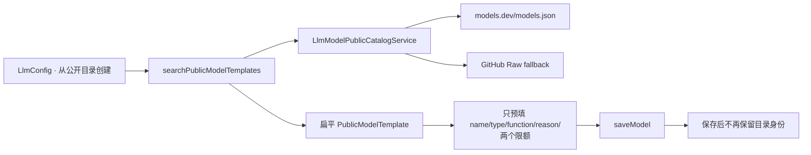
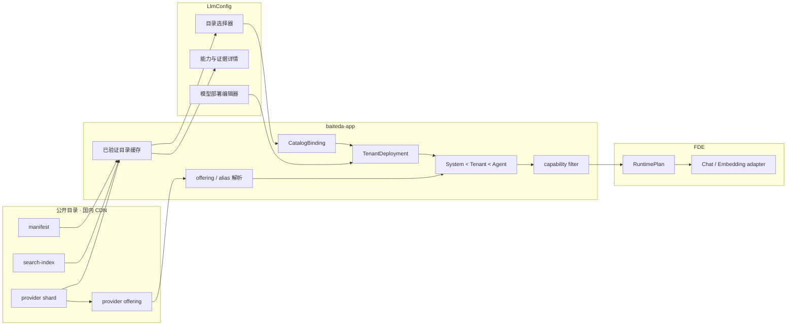

# LlmConfig 创建模型与公开目录联动设计

## 结论

`LlmConfig` 中的“从公开目录创建”不应继续被理解为“复制几个模板字段”，而应改成：**选择一个经过版本校验的 provider offering，为它创建一条租户 deployment，并把两者的绑定关系持久化**。

公开目录负责模型事实；`baiteda-app` 负责目录缓存、绑定校验和租户配置；`pro-lowcode-platform-front` 负责选择与展示；FDE 只消费经过 capability 过滤的运行时计划。浏览器和业务服务都不直接依赖 models.dev、GitHub 或国外厂商站点。

## 本次审计基线

2026-08-02 按以下工作树的当前 HEAD 重新审计；目标文件相对各自 HEAD 没有未提交差异，未修改两个现有仓库：

| 仓库 | HEAD | 审计范围 |
| --- | --- | --- |
| `pro-lowcode-platform-front` | `aebd62c62b8bbf7b282869d4f972375c13ec8946` | `src/views/LlmConfig/`、`src/services/llmConfigService.ts` |
| `baiteda-app` | `11a5b04316ae106a04d63156cae3fb1c36d07657` | 公开目录服务、模型保存 DTO/PO/VO、保存与下发逻辑 |
| 本目录仓库 | `0b59cead71da82a2a71d63d59fbfbb26a5729bf3` | Schema `2.4.0`、目录版本 `2026.08.5` 的 manifest、搜索索引和 provider 分片 |

## 当前链路与问题

当前已经有一个可见入口，但链路仍是：



| 当前行为 | 影响 |
| --- | --- |
| 后端默认访问 models.dev，失败后访问 GitHub Raw | 与“业务服务器只访问国内静态地址”的边界冲突 |
| 不读取 `manifest.json`，不校验 Schema、size、SHA-256 或目录版本 | 无法确认数据完整性，也无法安全缓存和回滚 |
| `PublicModelTemplate` 没有 `canonical_id`、`offering_id`、`catalog_version` | 保存后无法知道租户模型来自哪个 offering，后续也无法做增量差异提示 |
| 目录协议、细粒度 Agent 能力、三态、`max_input_tokens`、证据和生命周期在转换时丢失 | 前端只能展示粗粒度且可能误导的建议 |
| 选择模板后不填写 `model` 和协议 | 安全边界是对的，但也没有提供“官方 API ID作为建议值”和私有 ID 映射机制 |
| 前端强制聊天模型选择“是否推理”和 `function_call`；后端空值又默认成 `0` / `Unsupported` | 把 `unknown` 错写成 `false` |
| 目录的最大输出限额会被复制到 `max_tokens` | “上限事实”被误当成“每次请求的运行值” |
| `max_context_tokens` 被保存并在 FDE 中当成 `maxInputTokens` | context、input、output 三种限额被混用 |
| `temperature`、`top_p` 当前固定提交 `null` | 目前没有“配置了但不生效”，应继续保持，直到运行时映射与契约测试同时上线 |

## 目标数据关系



租户模型记录只保存目录绑定、租户实际 API model ID、私有端点和显式运行覆盖。canonical/offering 能力仍来自所绑定的、不可变的目录版本，不复制成一组可被租户随意改写的“官方事实”。

## 创建模型交互

### 1. 进入目录选择器

保留现有“从公开目录创建”按钮。弹窗首屏只查询后端缓存的轻量搜索索引，显示：

- 厂家 Logo、供应商、模型名称和 API model ID；
- Chat / Embedding、输入输出模态、生命周期和核验状态；
- 目录版本、生成时间、上游收集时间和逐条核验时间；
- `待加载详情`、`可配置`、`仅供参考`、`禁止新建`等业务准入状态。

搜索列表不需要下载完整 `catalog.json`。用户展开详情或点击“使用”时，后端才读取并校验对应 provider 分片。

搜索索引本身不包含完整协议和能力，因此列表首次出现时可以是 `detail_required`；用户选择后由 provider 分片给出最终状态。准入状态由集成层计算，不写回公开目录：

| 状态 | 条件与行为 |
| --- | --- |
| `detail_required` | 当前只有搜索摘要；点击后加载并校验 provider 分片，再计算最终状态 |
| `ready` | offering 有当前项目支持的明确协议，未 retired，关键字段满足对应运行角色；允许创建 |
| `reference_only` | 协议或关键能力仍为 `unknown`，或官方核验侧车要求 fail-closed；允许作为参考创建，但默认关闭管控，必须显示诊断 |
| `blocked` | offering 已 retired、官方路线明确不可用，或 Schema/哈希校验失败；禁止新建 |

`verification_status` 只表示证据核验程度，不能单独推出 `ready`。例如“官方 API ID 已核验”并不等于工具、流式或协议参数已可安全发送。

### 2. 选择 offering

选中后，编辑弹窗增加只读“公开目录绑定”区，展示：

- `provider_id`、`canonical_id`、`offering_id`；
- 固定的 `catalog_version` 和 provider 分片 SHA-256；
- 官方/目录 API model ID、可用协议、三类 Token 限额；
- Agent、推理、采样和 Embedding 能力三态；
- 字段证据与最后核验时间。

模型名称可以用目录名称预填。租户实际 `model` 默认建议为 offering 的 `api_model_id`，但允许修改：

- 相同：`binding_mode=exact`；
- 命中同 provider alias：`binding_mode=alias`；
- 私有网关使用自定义标识：必须由用户明确确认映射到当前 offering，保存为 `binding_mode=explicit_override`；
- 不允许根据名称、前缀或正则自动猜测 offering。

协议从 offering 的 `protocols` 中选择。只有一个协议时可以预选；多个协议时必须由用户选择；`unknown` 时不能自动选择。Base URL、API Key、环境和权重始终保持空白，由租户在现有端点区域填写。

原有“新增模型”按钮继续保留，用于没有目录记录的私有/自研模型。这类记录的绑定状态是 `unlinked`，能力默认 unknown；只有端点实测或受审计的显式 override 可以逐项收紧，不能从模型名称继承能力。

### 3. 区分能力事实与运行覆盖

编辑器应把字段分成三组：

1. **目录事实，只读**：context/input/output 上限、模态、细粒度 Agent 能力、推理能力、采样支持范围、证据。
2. **租户部署**：实际 API model ID、协议、环境端点、Key、权重、网络和适用范围。
3. **租户运行覆盖**：`max_output_tokens`、较小的 `max_input_tokens`、Embedding dimension，以及将来经过端到端映射的采样/推理参数。

目录的 `max_output_tokens` 是上限，不得自动写入租户的请求值。租户覆盖留空表示交给 System Default / Agent Policy；填写时必须不超过 offering 上限。`max_context_tokens` 只展示，绝不代替 `max_input_tokens`。

在 FDE 构造器映射和契约测试完成前，`temperature`、`top_p`、`top_k`、reasoning effort 等输入不在前端开放。上线后也必须按以下规则动态呈现：

- `supported=true`：允许填写，并按范围校验；
- `supported=false`：禁用且说明供应商不支持；
- `supported=unknown`：默认不发送，只显示诊断，不要求用户伪造结论。

### 4. 保存、编辑和升级

保存时固定本次选择的目录版本。以后目录更新只显示“有新版本可评审”，不自动改变已运行模型。

编辑页根据绑定状态显示：

| 状态 | UI 行为 |
| --- | --- |
| `bound_current` | 当前绑定仍是最新版本 |
| `update_available` | 显示新旧 offering 差异，用户人工确认后升级 |
| `deprecated` | 显示弃用时间和 replacement，不自动替换 |
| `unresolved` | 固定版本或 offering 暂时无法解析，继续使用最后验证缓存并报警 |
| `unlinked` | 历史/自定义模型；可手工绑定，不按模型名称猜测 |

升级差异至少比较 API model ID、协议、status、三类限额、`true/false/unknown` 能力变化和 replacement。能力降级、限额下降、协议删除或模型 retired 必须人工确认。

## 后端静态目录消费

保留前端只调用 `baiteda-app` 的 BFF 方式，重写 `LlmModelPublicCatalogService` 的数据源：

1. 只请求配置的国内 CDN `manifest.json`，支持 `If-None-Match`。
2. 校验 manifest Schema 和 `minimum_consumer_schema_version`。
3. 目录版本未变化时不重复下载索引或分片。
4. 版本变化时使用 manifest 中的 `immutable_path` 下载 `search-index.json`，校验 size 和 SHA-256 后原子切换缓存。
5. 用户请求详情时按 provider 下载不可变分片，并执行同样校验。
6. 失败时继续使用最后成功缓存；无缓存时使用随应用发布的内置快照。
7. 固定版本从 `versioned/{catalog_version}/manifest.json` 解析；国内对象存储不得删除仍被租户模型引用的历史版本。
8. 配置国内 CDN host allowlist；日志只记录目录版本、offering 和诊断，不记录端点或 Key。

最后成功缓存应持久化，而不是只放当前 Java 进程内存。可按 `(catalog_version, provider_id, shard_sha256)` 去重存储经过验证的公开分片；租户模型仅保存引用。这样目录临时不可用或服务重启也不会阻塞已有配置。

## 建议 API 契约

现有 `searchPublicModelTemplates` 可短期兼容，目标接口改用 offering 语义并版本化。

### 搜索

`POST /ego_app/api/v1/private/admin/LlmConfig/searchPublicModelOfferings`

```json
{
  "query": {
    "keyword": "glm",
    "provider_ids": ["zhipu"],
    "kinds": ["chat"],
    "statuses": ["active"]
  },
  "page": {
    "page_index": 1,
    "page_size": 20
  }
}
```

响应顶层携带：

- `catalog.schema_version`、`catalog.catalog_version`、`generated_at`；
- `catalog.collected_at`、`catalog.reviewed_at`；
- `source=download|cache|builtin_snapshot` 和非敏感 diagnostics；
- 行数据中的 catalog identity、Logo 不可变地址、模态、status 和 verification status。

搜索请求不得包含租户模型 ID、协议覆盖、URL 或 Key。

### 详情

`POST /ego_app/api/v1/private/admin/LlmConfig/queryPublicModelOfferingDetail`

```json
{
  "catalog_version": "2026.08.5",
  "offering_id": "zhipu/glm-5.2"
}
```

响应返回该版本中经过服务端复核的 `provider`、`canonical_model`、`offering`、适用 alias、provider 分片 SHA-256、准入状态和诊断。前端不得把搜索行中的摘要当成保存依据。

### 保存

目标保存 DTO 应把边界显式分组；过渡期可以在 controller 内适配现有扁平 DTO：

```json
{
  "name": "GLM-5.2 生产部署",
  "model": "tenant-gateway-glm",
  "catalog_binding": {
    "catalog_schema_version": "2.4.0",
    "catalog_version": "2026.08.5",
    "provider_id": "zhipu",
    "canonical_id": "zhipu/glm-5.2",
    "offering_id": "zhipu/glm-5.2",
    "catalog_api_model_id": "glm-5.2",
    "provider_shard_sha256": "<sha256>",
    "binding_mode": "explicit_override"
  },
  "api_protocol": "openai_chat_completions",
  "runtime_overrides": {
    "max_input_tokens": null,
    "max_output_tokens": null,
    "embedding_dimension": null
  }
}
```

端点、Key、环境和权重继续使用现有租户字段提交，此处不重复展示。服务端必须按 `catalog_version + offering_id` 重新加载 offering，并核对 provider/canonical/API ID/分片哈希；不能信任前端提交的能力、限额或证据正文。

## 字段映射

| 目录字段 | 创建页 | 租户保存 | 运行时 |
| --- | --- | --- | --- |
| `offering_id` / `canonical_id` / `provider_id` | 只读绑定身份 | 保存引用和版本 | 解析固定 offering，禁止按名称分支 |
| `api_model_id` | 作为实际 `model` 的建议值 | `model` 保存实际值，另存目录 API ID | 实际值进入 adapter；绑定只提供能力基线 |
| `protocols` | 只能选择明确列出的协议 | 保存具体 wire protocol | 决定 ChatOpenAI Responses/Chat Completions、ChatAnthropic 或 Embedding adapter |
| provider `public_base_urls` | 可作为说明，不自动写入 | 不属于目录绑定 | 实际 Base URL 永远来自 tenant deployment |
| `limits.max_context_tokens` | 只读 | 不作为运行覆盖 | 不映射 `model.profile.maxInputTokens` |
| `limits.max_input_tokens` | 显示上限，可允许较小覆盖 | 新增独立字段 | 映射 DeepAgent profile / Embedding 输入预检 |
| `limits.max_output_tokens` | 显示上限，不自动预填 | `max_output_tokens` 是可选运行覆盖 | 通过上限校验后映射 `maxTokens` |
| `capabilities.agent.*` | 九个三态只读展示 | 不由普通租户改写 | true 发送/启用；false 禁止；unknown 默认省略并诊断 |
| `capabilities.reasoning.*` | 细粒度展示 | 只保存已实现的策略覆盖 | 依 effort/budget/协议映射过滤 |
| `sampling_parameters.*` | 展示支持、范围和官方默认 | 仅保存 Tenant Override | 与 System/Agent 三层合并后过滤 |
| `embedding` | 展示维度、可选维度、输入和批量限制 | 运行时实现后才开放 dimension/batch override | 映射 `OpenAIEmbeddings` |
| lifecycle / evidence / Logo / 核验时间 | 展示和升级评审 | 只保存版本/哈希引用 | metadata only，不进入请求 |

旧字段只做兼容派生：

- `type`：`kind=embedding -> Embeddings`；chat 且明确包含非文本输入时为 `Multi`；纯文本为 `Chat`；未知不猜。
- `is_reason_model`：reasoning `true -> 1`、`false -> 0`、`unknown -> null`。
- `function_call`：`tool_call=true -> CallSupported`、`false -> Unsupported`、`unknown -> null`。目录目前没有“流式工具调用”独立事实，因此不得从 `streaming + tool_call` 推出 `StreamCallSupported`。
- 新运行时不再依赖这个单一枚举，而是分别读取 `tool_call`、`tool_choice`、`parallel_tool_calls`、`strict_tools`、`structured_output` 和 `json_schema`。

## 数据库字段建议

`system_def_llm_model` 在保留现有 tenant deployment 字段的基础上增加：

| 字段 | 用途 |
| --- | --- |
| `catalog_schema_version` | 保存时消费的 Schema 版本 |
| `catalog_version` | 固定不可变目录版本 |
| `catalog_provider_id` | offering provider |
| `catalog_canonical_id` | canonical model 引用 |
| `catalog_offering_id` | provider offering 引用 |
| `catalog_api_model_id` | 保存时目录中的 API ID，用于审计变更 |
| `catalog_binding_mode` | `exact / alias / explicit_override` |
| `catalog_shard_sha256` | 保存依据的 provider 分片哈希 |
| `max_input_tokens` | 与 context/output 分离的运行字段 |

`is_reason_model` 和 `function_call` 必须允许 null 表示 unknown，保存逻辑不得再给空值填 `0` 或 `Unsupported`。现有 `max_tokens` 可在兼容期明确解释为 tenant `max_output_tokens`；目录上限不能写入它。完整 capability 不复制到租户行，可保存在按版本和哈希去重的公共快照缓存中。

## 文件级实施清单

### pro-lowcode-platform-front

| 文件 | 变更 |
| --- | --- |
| `src/services/llmConfigService.ts` | 新增 offering 搜索/详情类型、catalog metadata、三态、binding 和 runtime override DTO；保留 v1 类型只用于过渡 |
| `src/views/LlmConfig/index.vue` | 目录列表显示 Logo/版本/核验时间；选中后加载详情；新增只读绑定区、绑定状态、协议选择、三限额分离和升级提示 |
| `src/views/LlmConfig/publicCatalogBinding.ts`（新增） | 集中实现类型派生、alias/override 判定、保存 payload 和 unknown 保留，避免逻辑继续堆在单个 Vue 文件中 |
| `src/views/LlmConfig/modelCapabilityAssistant.ts` | 端点探测只生成 tenant override 候选；删除把公开目录扁平模板直接写进运行字段的职责 |
| contract/unit tests | 覆盖无凭据搜索、版本固定、私有 ID override、unknown 不转 false、目录限额不预填、Logo 国内地址和不可用回退 |

### baiteda-app

| 文件/模块 | 变更 |
| --- | --- |
| `LlmModelPublicCatalogService.java` | 改为国内 manifest/index/shard 消费器；去掉 models.dev/GitHub runtime fallback；实现版本、哈希、ETag、持久缓存和内置快照 |
| 公开目录 BO/VO | 用 offering 语义替换扁平模板；返回 catalog metadata、identity、三态、证据摘要和准入诊断 |
| `LlmModelSaveDto.java` / `LlmModelDetailVo.java` | 增加 catalog binding 与 runtime override；详情返回绑定状态和可用更新 |
| `LlmInterfaceProtocolEnum.java` 与发布 VO | 增加明确 wire protocol，兼容期与旧 `OpenAI/Ollama/Anthropic` 分开；不能用一个 `OpenAI` 同时代表 Chat Completions、Responses 和 Embeddings |
| `SystemLlmModelPo.java` 与多数据库迁移 | 增加上述绑定字段和 `max_input_tokens`；保留私有端点字段原边界 |
| `LlmModelConfigServiceImpl.java` | 保存时服务端重解析 offering；unknown 不默认成 false；目录上限与运行覆盖分开；发布时携带绑定和能力版本 |
| 新增 resolver/cache | provider scoped alias 解析、固定版本缓存、更新差异和准入状态计算 |
| tests | 覆盖 manifest 未变不下载、哈希失败不切换、历史版本、内置快照、alias/override、无 secret、unknown 和保存防篡改 |

### FDE

FDE 的构造器映射仍按[现有项目参数审计与集成计划](audit-and-integration.md)执行。在 FDE 接收并验证 `catalog_version + offering_id`、独立 `max_input_tokens` 和细粒度能力之前，前端不得开放相应 tenant override。

## 推荐上线顺序

1. **目录消费基础**：baiteda 改读国内 CDN，完成 manifest/hash/cache/snapshot；提供 offering 搜索和详情 v2，旧接口保留兼容。
2. **绑定可追踪**：数据库和 Save/Detail API 增加 catalog binding；前端完成目录选择、Logo、核验时间、协议与私有 ID mapping。此阶段高级运行参数仍不可编辑。
3. **运行时闭环**：baiteda Resource VO 与 FDE 同时接入 `max_input_tokens`、细粒度能力和三层参数过滤，逐字段增加构造器契约测试。
4. **增量升级**：增加新版本提示、breaking diff、deprecated/replacement 迁移与历史版本保留策略。
5. **移除 v1**：确认没有旧前端/后端消费者后，删除扁平 `PublicModelTemplate` 和 models.dev 形状适配代码。

第一批联动不应同时开放 temperature/top_p/top_k。先把“选了谁、绑定哪个版本、实际调用什么 ID、unknown 如何处理”闭环做对，再按运行时契约逐个开放参数。

## 验收用例

- 搜索只访问 baiteda；baiteda 只访问配置的国内 CDN，不出现 models.dev/GitHub runtime 请求。
- manifest 版本不变时，不重复下载 search index 或 provider 分片。
- size、SHA-256、Schema 或最低消费版本失败时，不污染最后成功缓存。
- 选择 offering 后保存 identity、目录版本和哈希；编辑时可恢复同一绑定。
- 租户实际模型 ID 与目录 API ID 不同时，必须保存 `explicit_override`；同 provider alias 可确定性解析；不按名称猜测。
- `unknown` 在前端、DTO、数据库、Resource VO 和 FDE 全链路保持 unknown/null，不变成 false。
- context/input/output 三类限额分别展示；目录最大输出不会自动写成请求 `max_tokens`。
- Base URL、Key、环境和权重不会进入目录查询、目录缓存键、公开日志或静态文件。
- 目录标记 false/unknown 的参数不会进入 ChatOpenAI、ChatAnthropic、Embedding 或 DeepAgent 请求，并产生明确诊断。
- 新目录版本不会自动改变已有租户模型；降级、限额下降、协议删除和 retired 必须人工评审。
