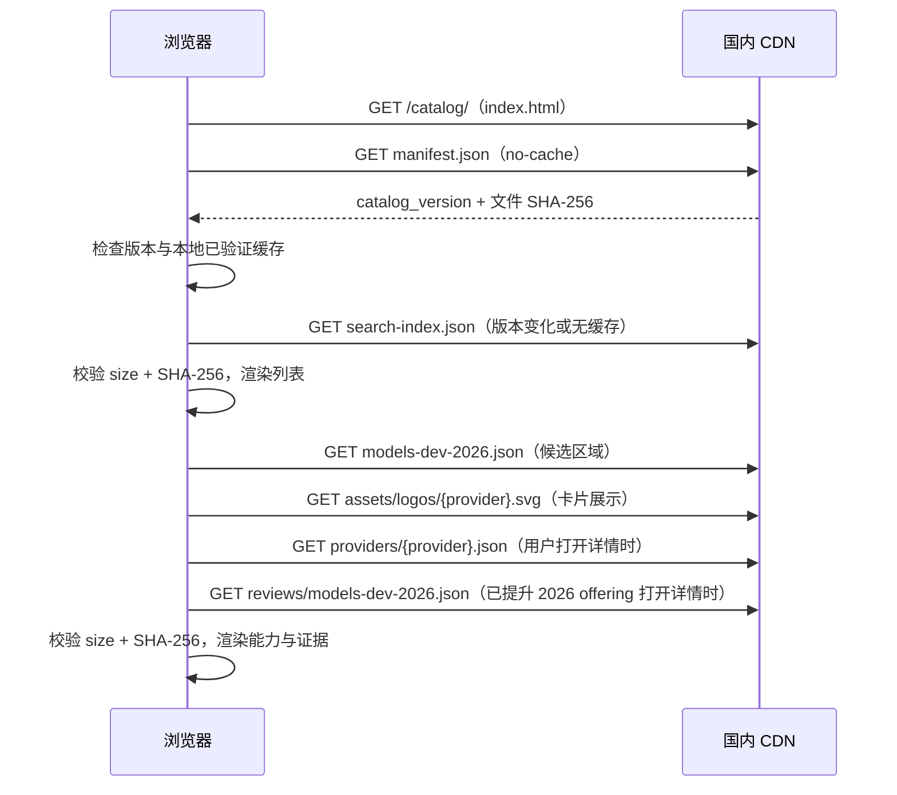

# 静态目录浏览界面

## 定位

浏览界面让运维、产品和研发人员直接打开国内 CDN 地址查看目录，但不改变数据权威边界。`catalog/` 源 JSON 和由它生成的发布 JSON 仍是权威数据；`web/` 只提供通用渲染器，不内置模型名单、不维护第二份能力数据，也不提交任何租户部署配置。

界面是原生 HTML、CSS 和 JavaScript，没有框架、字体 CDN、统计脚本、数据库或动态 API。页面运行时只访问部署它的同一 CDN prefix：



## 可浏览内容

- 按名称、API model ID、canonical/offering ID、系列和别名搜索。
- 按 provider、Chat/Embedding、输入模态和生命周期状态筛选。
- 查看 API 标识、协议、输入/输出模态以及严格分离的 context/input/output 上限。
- 查看 Agent 能力的 `支持 / 不支持 / 未知` 三态、推理模式与协议字段。
- 查看 temperature、top_p、top_k 的“是否支持、范围、官方默认、协议映射”；页面明确说明这些不是租户运行默认值。
- 查看 Embedding 维度、输入和批量限制。
- 查看生命周期、字段级 runtime/metadata/unsupported 标记、adapter mapping 与证据来源。
- 主目录卡片和详情页按 `search-index.json` 的 `manufacturer_logo` 显示同源 SVG 厂家标识；已提升的 2026 条目会区分“API 标识已核验”“模型已核验”“官方路线不可用”和“上游观测 · 未核验”。
- 打开已提升的 2026 offering 详情时，页面从同源核验侧车读取该条记录的官方 API ID/协议（如有）、逐条官网链接和 `keep_fail_closed` 处置；这些结论只用于浏览与审计，绝不自动进入构造器或请求参数。
- 目录统计卡同时显示 models.dev 上游收集时间与逐条核验时间；它们来自已验证的轻量搜索索引 `models_dev_sync`，并随来源修订/快照哈希作为后续增量更新基线。
- 浏览尚未纳入主目录的 models.dev 2026 收录路线，按厂家和名称筛选；页面以 `provider + canonical + API ID` 精确去重，不重复显示上方已有的 offering。路线卡片显示同源 SVG logo、收录日期、路由类型和上游限额提示，并明确标注“未官方核验”。
- 页面在可用宽度内使用自适应紧凑卡片网格，不设置桌面最大内容宽度；卡片标题仅在其前缀与左上角厂家一致时裁去该前缀，源 JSON 的原始名称保持不变。

页面不展示或加载 API Key、私有 Base URL、环境、权重、负载均衡或其他 tenant deployment 数据。证据 URL 仅作为可点击链接出现，页面初始化和搜索不会请求厂商网站。

## iframe 选择模式

业务前端用 `embed=picker&protocol_version=1&parent_origin=...&session_id=...` 打开同一 `index.html` 时，页面隐藏首页介绍、上游路线和页脚，保留紧凑搜索、卡片和详情。用户在详情中点击“使用此模型”后，页面以 channel `com.baiteda.public-llm-catalog` 向精确的 `parent_origin` 发送 `catalog.selection`。

目录端会核对 parent origin、referrer origin 与 session；父页面还必须核对 `event.origin`、`event.source`、channel、版本和 session。消息只投影公开 identity、协议、模态、限额、三态能力、Embedding 摘要和 provider 分片哈希，不含租户、端点或凭据。普通访问不带 embed 参数时仍是完整独立浏览页。

## 加载、缓存与失败策略

1. 每次打开先请求小型 `manifest.json`，不直接下载完整 `catalog.json`。
2. search index 和 provider 分片从 manifest 指定的不可变版本路径下载，并且必须同时通过声明的字节数和 SHA-256 校验后才进入浏览器缓存。
3. 缓存键包含内容哈希；相同目录版本不会重复下载已经验证的索引或分片。
4. manifest 暂时不可用时尝试读取上次成功的 manifest 和已验证内容缓存，并在页头标明“缓存版本”。
5. 没有可验证缓存时显示明确错误，不拿不完整响应继续渲染。

业务服务器仍应使用 `src/consumer.ts` 所示的持久缓存和内置快照状态机；浏览器 localStorage 只服务人员浏览，不能替代业务端的内置快照。

## 发布约束

- 浏览资产进入 manifest 后，发布契约为 Schema `2.4.0`；相较 `2.3.x` 在轻量搜索索引增加上游收集/核验时间点和增量比对元数据。旧消费端应继续使用旧缓存/内置快照，升级解析器后再切换。
- 必须整体发布 `dist/`，不能只上传 JSON；HTML/CSS/JS 也在 manifest、gzip/brotli 和不可变版本树中。
- CDN prefix 根路径必须把 `index.html` 作为默认文档。
- 必须使用 HTTPS。浏览器依赖 Web Crypto 校验 SHA-256，生产 HTTP 页面不属于支持的部署形态。
- 页面使用相对路径，因此可部署在域名根路径或任意 prefix；不要添加 `<base>` 重写。
- 页面 CSP 只允许同源脚本、样式和请求；若企业网关注入脚本，应先做独立安全评审，不要直接放宽为任意域名。
- CDN 响应不得用 `X-Frame-Options` 阻止 picker；若通过 HTTP Header 配置 CSP `frame-ancestors`，应只放行实际部署的模型管理前端 origin。HTML meta CSP 不能代替该响应头配置。
- 发布后必须从国内 runner 执行 `npm run probe -- https://实际地址/prefix/`；探测会同时验证根首页、资源类型、哈希、缓存、压缩和分片。

## 本地验证

```bash
npm run preview
```

该命令先重新构建 `dist/`，再在 `127.0.0.1:4173` 启动只读预览。可用 `CATALOG_PREVIEW_PORT=5180 npm run preview` 修改端口。完成页面检查后终止进程即可；生产环境不运行该脚本。
